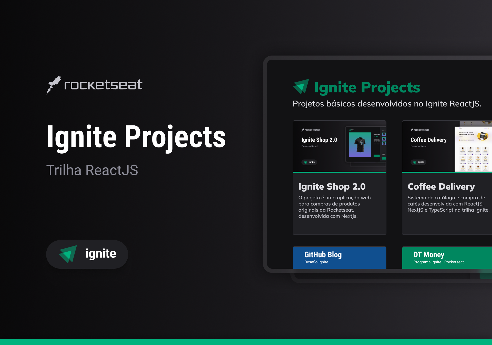

<div align="center">
  
</div>

# Ignite Projects

Conjunto de projetos básicos desenvolvidos no Ignite utilizando ReactJS. Destinado a conclusão de tarefas para desenvolvimento do curso.

<div align="center">
    
</div>

## 🚀 Tecnologias

Estes projetos foram desenvolvidos com tecnologias como:

- [Next.js](https://nextjs.org/)
- [TypeScript](https://www.typescriptlang.org/)
- [StyledComponents](https://styled-components.com/)
- [Axios](https://axios-http.com/ptbr/docs/intro)
- [Zod](https://zod.dev/)
- [Stitches](https://stitches.dev/)
- [ESLint](https://eslint.org/)
- [Prettier](https://prettier.io/)
- [Vite](https://vitejs.dev/)
  
## 💻 Acessar os projetos online

| Nome             | Descrição                                                                            | Acesse Online                                           | Repositório                                                                                           |
|------------------|--------------------------------------------------------------------------------------|-------------------------------------------------------- |-------------------------------------------------------------------------------------------------------|
| Ignite Shop      | E-commerce para compras de produtos originais da Rocketseat utilizando Stripe.       | [Acesse o site](https://igniteshopapp.vercel.app/)     | [Veja o Repositório](https://github.com/mateussantanasilva/IgniteProjects/tree/main/IgniteShop)     |
| Github Blog      | Blog que usa a API do GitHub para buscar issues de um repositório.                   | [Acesse o site](https://githubblogapp.netlify.app/)     | [Veja o Repositório](https://github.com/mateussantanasilva/IgniteProjects/tree/main/GithubBlog)     |
| DT Money         | Permite controle financeiro que utiliza o JSON server para simulação de uso de API.  | Desenvolvendo...                                        | [Veja o Repositório](https://github.com/mateussantanasilva/IgniteProjects/tree/main/DTMoney)        |
| Coffee Delivery  | Loja com um catálogo variado de cafés que permite relizar os pedidos que desejar  .  | [Acesse o site](https://coffeedeliveryapp.netlify.app/) | [Veja o Repositório](https://github.com/mateussantanasilva/IgniteProjects/tree/main/CoffeeDelivery) |
| Ignite Timer     | Cronometro para realização de tarefas, com de histórico de todas as atividades.      | [Acesse o site](https://ignitetimerapp.vercel.app/)     | [Veja o Repositório](https://github.com/mateussantanasilva/IgniteProjects/tree/main/IgniteTimer)    |
| ToDo List        | Lista de tarefas para controlar todos os compromissos que forem cadastrados.         | [Acesse o site](https://to-dolist-app.vercel.app/)      | [Veja o Repositório](https://github.com/mateussantanasilva/IgniteProjects/tree/main/ToDoList)       |
| Ignite Feed      | Simulação de uma rede social inicial para demonstrar conceitos do React.             | [Acesse o site](https://ignitefeed-app.netlify.app/)    | [Veja o Repositório](https://github.com/mateussantanasilva/IgniteProjects/tree/main/IgniteFeed)     |

## 💻 Acessar os projetos local

### :white_check_mark: Requisitos ###

Antes de começar :checkered_flag:, você precisa ter o [Git](https://git-scm.com) e o [Node](https://nodejs.org/en/) instalados.

### :checkered_flag: Começo ###

```bash
# Clone o projeto
$ git clone https://github.com/mateussantanasilva/IgniteProjects.git

# Acesse a pasta clonada
$ cd IgniteProjects/

# Acesse o projeto que desejar
$ cd <nomeDoProjeto>/

# Instale as dependências
$ npm install

# Execute o projeto
$ npm run dev
```

## 🧑🏻 Autor

[Mateus Santana da Silva](https://github.com/mateussantanasilva)
<div align="left">
  <a href="https://www.linkedin.com/in/mateus-santana-silva/" target="_blank">
    
  </a>
  <a href="mailto:santanasilva1778@gmail.com" target="_blank">
    

## ⚖️ Licença

[MIT License](https://github.com/mateussantanasilva/SpaceTime/blob/main/LICENSE)
